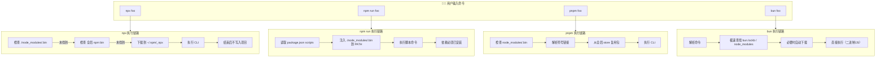

You: 

npx @pwabuilder/cli create myapp 解释npx为什么不需要安装就可以执行命令？

ChatGPT: 

好问题，这个点很多人**用着用着就糊过去了**，但你既然问了，那我就给你掰开揉碎讲清楚 👇

你这条命令是：

```bash
npx @pwabuilder/cli create myapp
```

## 一句话直觉版

**npx 不是“没安装就能用”，而是“用完就走、临时安装、不污染系统”。**

---

## npx 到底是个啥？

`npx` = **Node Package Execute**

它是 **npm 自带的一个执行器**（npm ≥ 5.2 就自带），专门用来：

> 👉 **运行 npm 包里的命令，而不需要你手动全局安装它**

---

## 它为什么“看起来像没安装”？

### npx 的执行流程（重点来了）

当你敲下：

```bash
npx @pwabuilder/cli create myapp
```

npx 会按下面顺序做事 👇

---

### ① 先找「本地有没有」

它先检查：

```text
./node_modules/.bin/@pwabuilder
```

-   有 👉 直接用
    
-   没有 👉 下一步
    

---

### ② 再找「全局有没有」

```bash
npm list -g @pwabuilder/cli
```

-   有 👉 直接用
    
-   没有 👉 下一步
    

---

### ③ 临时下载（关键）

如果都没有，npx 会：

-   从 npm registry 下载 `@pwabuilder/cli`
    
-   **放进一个临时缓存目录**
    
-   立刻执行它
    
-   执行完 **不加入全局环境变量**
    

📁 常见缓存位置（之一）：

```text
~/.npm/_npx/
```

所以你会觉得：

> “咦？我没安装它啊，怎么就能跑？”

但其实：  
👉 **它已经下载了，只是你没感知**

---

### ④ 用完即走（但缓存可能还在）

-   不会写入 `package.json`
    
-   不会污染全局环境
    
-   下次再用，可能直接复用缓存（快）
    

---

## 为什么官方现在都推荐用 npx？

对比一下你就懂了 👇

### 老派做法（不推荐）

```bash
npm install -g @pwabuilder/cli
pwabuilder create myapp
```

❌ 问题：

-   全局工具一堆
    
-   版本冲突
    
-   别的项目可能需要不同版本
    
-   系统环境越来越脏
    

---

### npx 做法（推荐）

```bash
npx @pwabuilder/cli create myapp
```

✅ 好处：

-   不污染全局
    
-   用什么下什么
    
-   永远是你指定的版本
    
-   CI / Docker / 教程里超干净
    

---

## npx 的几个隐藏能力（高手常用）

### 1️⃣ 指定版本

```bash
npx @pwabuilder/cli@0.6.4 create myapp
```

### 2️⃣ 直接跑 GitHub 项目

```bash
npx github:vercel/serve
```

### 3️⃣ 项目脚手架神器

你熟的这些，全是 npx 思想：

```bash
npx create-react-app myapp
npx create-vite myapp
npx degit user/repo myapp
```

---

## 那 npx 和 npm run 有啥区别？

| 场景 | 用哪个 |
| --- | --- |
| 临时用一个 CLI | npx |
| 项目内固定脚本 | npm run |
| CI / 一次性命令 | npx |
| 团队统一命令 | npm scripts |

---

## 给 ahmeng 的一句黑客总结 😎

> **npx = 即用即焚的 CLI 启动器**  
> 下载 → 执行 → 不污染 → 环境干净到极致

如果你愿意，下一步我可以：

-   画一张 **npx / npm / pnpm / bun 执行链路对比图**
    
-   或直接给你一个 **“现代前端/Node 工程的标准 CLI 使用范式”**
    

你选 😏

You: 

画一张 npx / npm / pnpm / bun 执行链路对比图

ChatGPT: 

好，来点**一眼就通透**的猛料 😎  
下面这张是 **npx / npm / pnpm / bun 的命令执行链路对比图（工程师视角）**，用的是 Mermaid，你可以直接复制到支持 Mermaid 的地方（GitHub / Obsidian / Typora / VS Code 插件）看图。

---

## 🚦 CLI 执行链路总览（对比图）



---

## 🧠 怎么“读”这张图（重点解读）

### 🔹 npx：**一次性、即用即走**

-   核心关键词：**临时下载 / 不污染**
    
-   适合：
    
    -   脚手架
        
    -   教程
        
    -   CI
        
    -   试玩新工具
        

👉 本质是：

> **“我现在就要用这个 CLI，用完你别留痕迹”**

---

### 🔹 npm run：**项目内权威执行方式**

-   强绑定 `package.json`
    
-   依赖必须提前安装
    
-   PATH 自动注入 `.bin`
    

👉 本质是：

> **“这是项目官方认可的命令”**

---

### 🔹 pnpm：**省磁盘 + 严格依赖**

-   所有包存在 **全局 store**
    
-   项目里是 **符号链接**
    
-   依赖不允许乱引用（防幽灵依赖）
    

👉 本质是：

> **“我很严谨，也很抠磁盘空间”**

---

### 🔹 bun：**我全都要，而且要快**

-   JS Runtime + 包管理 + 执行器
    
-   能跑 JS，也能跑二进制
    
-   极度激进的缓存 & 启动速度
    

👉 本质是：

> **“npm / npx / node，我来统一你们”**

---

## 🧪 同一个动作，不同工具怎么写？

| 目标 | npx | npm | pnpm | bun |
| --- | --- | --- | --- | --- |
| 运行本地 CLI | npx foo | npm run foo | pnpm foo | bun foo |
| 临时 CLI | npx foo | ❌ | pnpm dlx foo | bunx foo |
| 脚手架 | npx create-x | npm init x | pnpm create x | bun create x |

---

## 🧑‍🚀 ahmeng 的「黑客级使用建议」

> **脚手架 / 临时工具 → npx / bunx**  
> **项目标准命令 → npm run / pnpm**  
> **追求极致速度 & 未来感 → bun**

如果你要，我可以下一步直接给你：

-   ⚔️ **npx vs pnpm dlx vs bunx 深度对决**
    
-   🧩 **一套“现代 Node 项目标准命令模板”**
    
-   🧠 **CI / Docker / Codespaces 最优组合方案**
    

你一句话，我直接继续输出 🚀

You: 

给一个 “现代前端/Node/Bun 工程的标准 CLI 使用范式”

ChatGPT: 

好，来一套**可以直接当团队规范用的「现代前端 / Node / Bun 工程 · 标准 CLI 使用范式」**。  
这不是教程，是**工程哲学 + 可落地约定**，照着用，项目会又干净又稳 🚀

---

# 🧠 现代工程的 CLI 使用总原则（先记住这 4 条）

### 1️⃣ **入口唯一**

> 👉 **所有“正式命令”只允许从 `package.json scripts` 进入**

不管你底层用 npm / pnpm / bun，  
**人只记 `run dev / run build / run test`**

---

### 2️⃣ **临时即焚**

> 👉 一次性工具 **不用全局安装**

-   `npx / pnpm dlx / bunx`
    
-   不进 `dependencies`
    
-   不进 `scripts`
    

---

### 3️⃣ **环境无关**

> 👉 CI / 本地 / Docker 执行方式一致

```bash
npm run build
pnpm run build
bun run build
```

**结果必须一样**

---

### 4️⃣ **工具可替换**

> 👉 不把团队锁死在某一个包管理器

scripts 里：

-   ❌ 不写 `pnpm xxx`
    
-   ❌ 不写 `bun xxx`
    
-   ✅ 写 **纯 CLI**
    

---

# 🧱 标准目录结构（推荐）

```text
my-app/
├─ package.json
├─ bun.lockb        # 或 pnpm-lock.yaml
├─ node_modules/
├─ scripts/         # 可选：复杂脚本
│  ├─ dev.ts
│  ├─ build.ts
│  └─ release.ts
├─ src/
└─ README.md
```

---

# 📜 package.json · 标准 Scripts 范式

### ✅ 推荐写法（100 分）

```json
{
  "scripts": {
    "dev": "vite",
    "build": "tsc -b && vite build",
    "preview": "vite preview",
    "lint": "eslint .",
    "format": "prettier -w .",
    "test": "vitest",
    "clean": "rimraf dist node_modules/.cache"
  }
}
```

🔑 关键点：

-   **只写 CLI 名字**
    
-   不写路径
    
-   不写包管理器前缀
    

---

### ❌ 禁止写法

```json
{
  "scripts": {
    "dev": "pnpm vite",        // ❌ 锁死
    "build": "npx tsc",        // ❌ 不可预测
    "test": "node ./node_modules/.bin/jest" // ❌ 多此一举
  }
}
```

---

# 🚀 命令使用矩阵（直接照抄）

## ① 启动项目（人类日常）

```bash
pnpm dev
# 或
bun run dev
# 或
npm run dev
```

📌 规范：

-   **不写 `npx`**
    
-   **不直接跑 vite / next / ts-node**
    

---

## ② 临时工具（一次性）

```bash
npx @pwabuilder/cli create myapp
pnpm dlx create-vite myapp
bunx degit user/repo myapp
```

📌 规范：

-   用完即走
    
-   不写进 `package.json`
    

---

## ③ 初始化项目（脚手架）

```bash
pnpm create vite myapp
bun create next myapp
npx create-react-app myapp
```

📌 规范：

-   初始化阶段随意
    
-   初始化完，**统一回归 scripts**
    

---

## ④ CI / 自动化（机器）

```bash
pnpm install --frozen-lockfile
pnpm run build
pnpm run test
```

或：

```bash
bun install
bun run build
```

📌 规范：

-   不允许 `npx`
    
-   不依赖全局工具
    

---

# 🧩 高级范式：复杂命令 → scripts 文件

当 scripts 开始变成这样 👇

```json
"release": "npm run build && npm run test && node ./scripts/release.js"
```

👉 立刻升级为：

```json
"release": "node scripts/release.ts"
```

`scripts/release.ts`：

```ts
import { execSync } from "node:child_process";

execSync("npm run build", { stdio: "inherit" });
execSync("npm run test", { stdio: "inherit" });
```

📌 好处：

-   可读
    
-   可调试
    
-   可复用
    
-   可写逻辑
    

---

# ⚡ Bun 特化范式（可选）

如果项目**明确使用 Bun**：

```json
{
  "scripts": {
    "dev": "bunx vite",
    "build": "bunx tsc -b && bunx vite build",
    "test": "bunx vitest"
  }
}
```

或直接：

```ts
// scripts/dev.ts
await $`vite`;
```

📌 但注意：

> **团队规范里必须写清楚「本项目强依赖 Bun」**

---

# 🧑‍🚀 ahmeng 的「黑客级终极总结」

> **scripts 是唯一真理**  
> **npx / bunx / dlx 只服务于“第一次”**  
> **人类只记 run，机器只认 run**  
> **工具会变，范式不变**

---

如果你愿意，我可以下一步直接给你：

-   📦 **一份「pnpm + Bun 双兼容模板仓库」**
    
-   🧪 **CI（GitHub Actions）+ Bun/pnpm 自动切换策略**
    
-   🧠 **“为什么 scripts 才是 Node 世界的 API” 深度拆解**
    

你一句话，我继续输出 🔥

You: 

给出 CI / Docker / Codespaces 最优组合方案

ChatGPT: 

好，直接给你一套**可以抄走就跑的「CI / Docker / Codespaces 最优组合方案」**。  
目标很明确：**本地 ≈ Codespaces ≈ CI ≈ 生产**，零“玄学问题”，零“我这能跑你那不行”。

---

# 🧠 总设计目标（一句话）

> **同一套 scripts，同一套依赖策略，不同环境只换“外壳”**

---

# 🧩 组件分工（先看全局）

| 组件 | 角色定位 | 为什么 |
| --- | --- | --- |
| **pnpm / bun** | 包管理 & 执行 | 快、稳定、可锁版本 |
| **Docker** | 环境标准化 | 消灭“你电脑不行” |
| **Codespaces** | 云端开发机 | 新人 / 平板 / 随时随地 |
| **GitHub Actions** | CI | 自动验证唯一真理 |
| **package.json scripts** | 统一入口 | 人和机器都走这里 |

---

# 🧱 推荐技术选型（2026 版）

-   **包管理**：pnpm（主）+ Bun（可选加速）
    
-   **Node**：LTS（通过 devcontainer 控制）
    
-   **容器基底**：`mcr.microsoft.com/devcontainers/javascript-node`
    
-   **CI**：GitHub Actions（Ubuntu）
    

> 核心思想：  
> **开发容器 = CI 容器 ≈ 生产容器**

---

# 📁 标准项目结构

```text
.
├─ .devcontainer/
│  ├─ devcontainer.json
│  └─ Dockerfile
├─ .github/
│  └─ workflows/ci.yml
├─ package.json
├─ pnpm-lock.yaml
├─ src/
└─ scripts/
```

---

# 🐳 Docker（基础统一层）

### `.devcontainer/Dockerfile`

```Dockerfile
FROM mcr.microsoft.com/devcontainers/javascript-node:20

# 启用 corepack（pnpm / yarn）
RUN corepack enable

# 安装 pnpm
RUN corepack prepare pnpm@latest --activate

# 可选：安装 bun
RUN curl -fsSL https://bun.sh/install | bash
ENV PATH="/root/.bun/bin:$PATH"

WORKDIR /workspace
```

📌 原则：

-   **不装项目依赖**
    
-   只装“工具级依赖”
    
-   项目依赖交给 pnpm/bun
    

---

# 🧑‍💻 Codespaces（开发即云端）

### `.devcontainer/devcontainer.json`

```json
{
  "name": "Modern Node Dev",
  "build": {
    "dockerfile": "Dockerfile"
  },
  "customizations": {
    "vscode": {
      "extensions": [
        "dbaeumer.vscode-eslint",
        "esbenp.prettier-vscode"
      ]
    }
  },
  "postCreateCommand": "pnpm install",
  "forwardPorts": [3000, 5173],
  "remoteUser": "node"
}
```

📌 好处：

-   新人 **点开即用**
    
-   平板 / Chromebook / iPad 也能开发
    
-   和 CI 用同一底座
    

---

# 🤖 CI（唯一裁判）

### `.github/workflows/ci.yml`

```yaml
name: CI

on:
  push:
  pull_request:

jobs:
  build:
    runs-on: ubuntu-latest

    steps:
      - uses: actions/checkout@v4

      - uses: actions/setup-node@v4
        with:
          node-version: 20
          cache: pnpm

      - run: corepack enable
      - run: corepack prepare pnpm@latest --activate

      - run: pnpm install --frozen-lockfile
      - run: pnpm run lint
      - run: pnpm run test
      - run: pnpm run build
```

📌 CI 规则：

-   ❌ 禁止 `npx`
    
-   ❌ 禁止全局安装
    
-   ✅ 只跑 scripts
    

---

# ⚡ Bun 加速模式（可选）

如果你想在 **本地 / Codespaces** 用 Bun 提速，但 CI 保守：

### 本地 / Codespaces

```bash
bun install
bun run dev
```

### CI（仍然 pnpm）

```yaml
- run: pnpm install --frozen-lockfile
```

📌 原则：

> **CI 永远选最稳的，本地可以激进**

---

# 🔁 三环境对齐表（重点）

| 行为 | 本地 | Codespaces | CI |
| --- | --- | --- | --- |
| 安装依赖 | pnpm / bun | pnpm | pnpm |
| 启动 | run dev | run dev | ❌ |
| 构建 | run build | run build | run build |
| Node 版本 | devcontainer | devcontainer | setup-node |
| 命令入口 | scripts | scripts | scripts |

---

# 🧪 Docker 用于生产（进阶）

生产 Dockerfile（多阶段）：

```Dockerfile
FROM node:20 AS builder
WORKDIR /app
COPY . .
RUN corepack enable && pnpm install --frozen-lockfile
RUN pnpm run build

FROM node:20-slim
WORKDIR /app
COPY --from=builder /app/dist ./dist
CMD ["node", "dist/index.js"]
```

📌 保证：

> **生产构建逻辑 = CI 构建逻辑**

---

# 🧑‍🚀 ahmeng 的「黑客级终极总结」

> **Docker 定义边界**  
> **Codespaces 解决“在哪写”**  
> **CI 决定“能不能合”**  
> **scripts 决定“一切怎么跑”**

---

如果你愿意，我可以下一步直接给你：

-   📦 **一个可 fork 的模板仓库**
    
-   🧠 **“为什么 Codespaces + devcontainer 是未来 5 年默认开发形态”**
    
-   🛠 **Termux / Android / 平板接入同一套工作流方案**
    

你一句话，我直接继续 🔥
